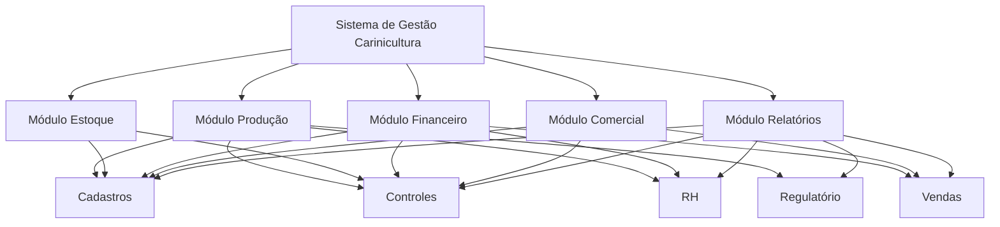
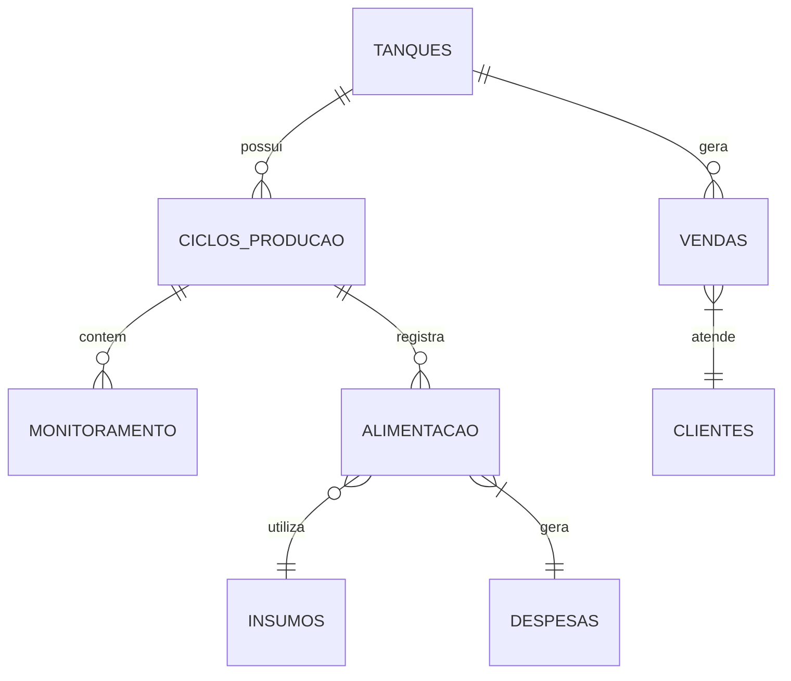
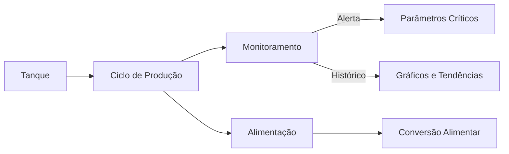
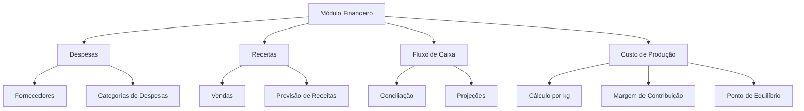
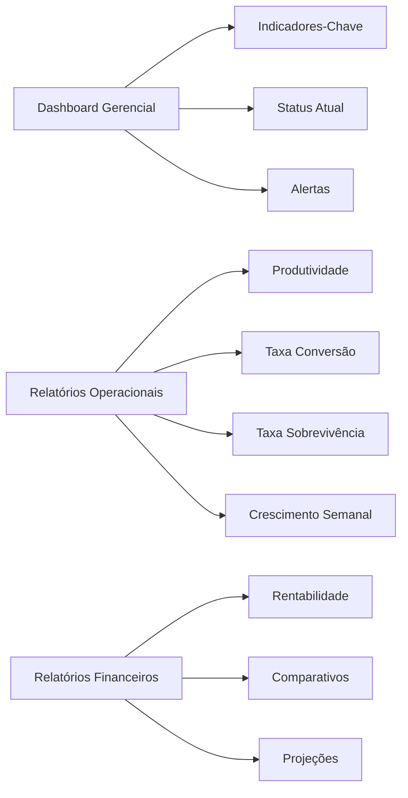
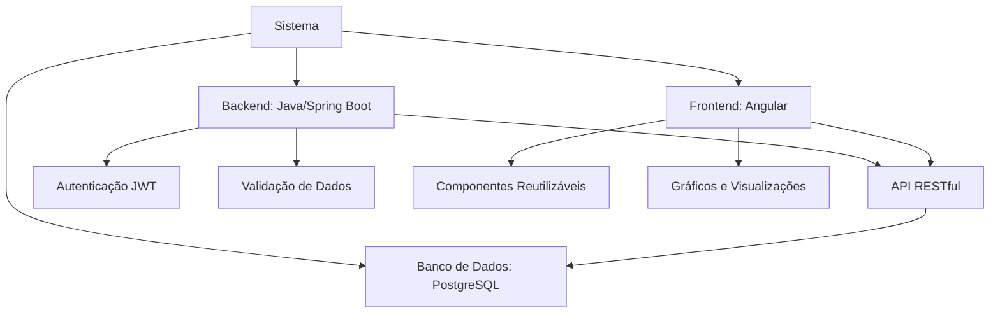
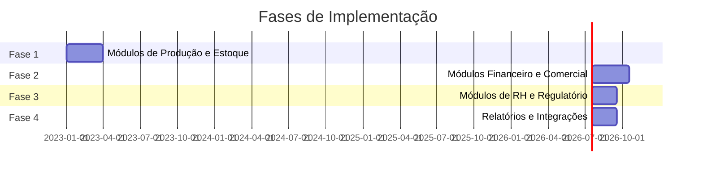
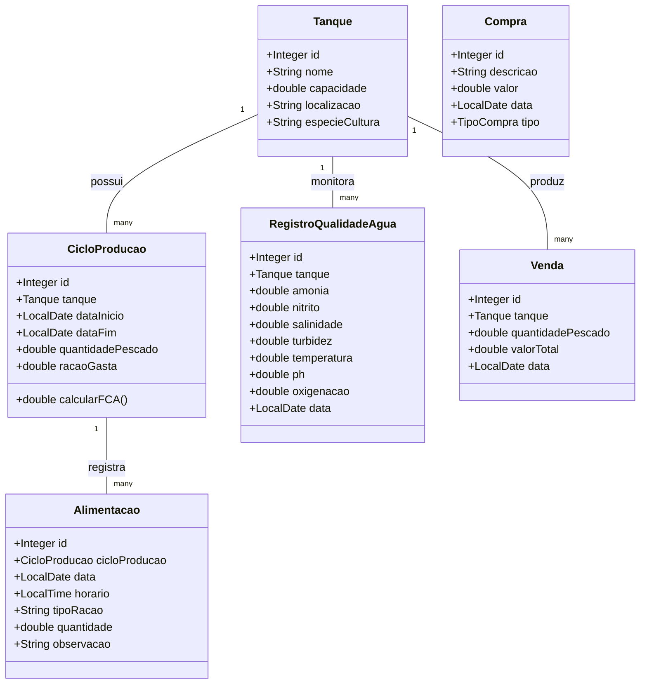
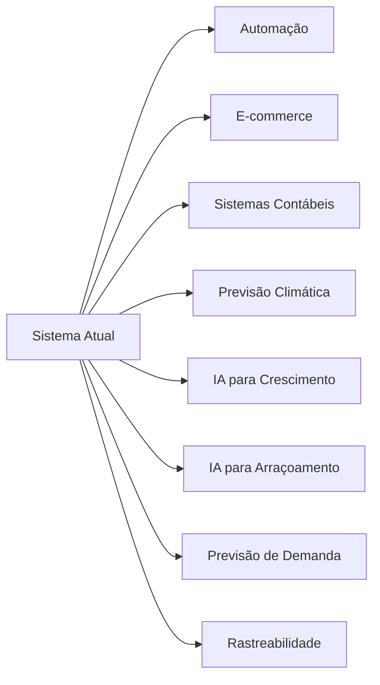
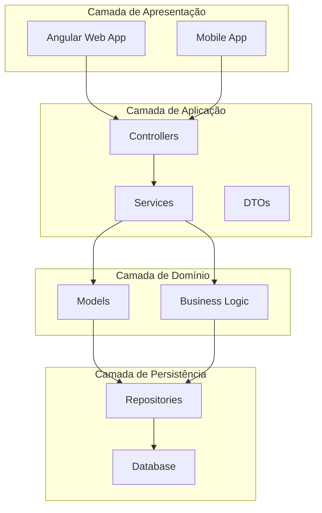

# Sistema Integrado de Gestão para Carinicultura

## 1. Arquitetura do Sistema

### 1.1 Visão Geral

O sistema é estruturado de forma modular, com interfaces intuitivas e banco de dados relacional para armazenamento das informações. A arquitetura é composta por módulos interconectados que compartilham informações entre si.

### 1.2 Banco de Dados

Estrutura relacional com as seguintes entidades principais:

## 2. Módulos do Sistema

### 2.1 Módulo de Produção

#### 2.1.1 Gestão de Tanques/Viveiros
- Cadastro de tanques com especificações técnicas
- Histórico de uso de cada tanque
- Status atual (ativo, em manutenção, em preparação)
- Capacidade e dimensões

#### 2.1.2 Ciclos de Produção
- Registro de ciclos por tanque
- Data de início e previsão de término
- Densidade de estocagem
- Origem das pós-larvas/juvenis
- Quantidade inicial

#### 2.1.3 Monitoramento de Parâmetros
- Registro diário de parâmetros de qualidade da água
  - pH
  - Oxigênio dissolvido
  - Temperatura
  - Salinidade
  - Amônia
  - Nitrito
- Alertas para parâmetros fora do ideal
- Visualização gráfica de tendências

#### 2.1.4 Manejo Alimentar
- Planejamento de arraçoamento
- Registro de alimentação (tipo, quantidade, frequência)
- Cálculo automático da taxa de conversão alimentar
- Ajustes baseados no crescimento observado

#### 2.1.5 Saúde e Biossegurança
- Registro de ocorrências sanitárias
- Protocolo de tratamentos
- Histórico de doenças por tanque
- Medidas preventivas aplicadas

### 2.2 Módulo de Estoque

#### 2.2.1 Insumos
- Cadastro de todos os insumos (ração, produtos químicos, medicamentos)
- Controle de lotes e validade
- Histórico de entrada/saída
- Ponto de reposição e estoque mínimo

#### 2.2.2 Equipamentos
- Cadastro de equipamentos (aeradores, bombas, medidores)
- Histórico de manutenção
- Status de funcionamento
- Programação de manutenções preventivas

#### 2.2.3 Produto Final
- Controle de estoque de camarões para venda
- Classificação por tamanho/categoria
- Rastreabilidade (tanque de origem, ciclo)
- Histórico de processamento

### 2.3 Módulo Financeiro

#### 2.3.1 Despesas
- Cadastro de fornecedores
- Registro de despesas fixas e variáveis
- Categorização (ração, energia, mão de obra, etc.)
- Previsão de despesas por ciclo

#### 2.3.2 Receitas
- Registro de vendas
- Categorização por cliente/tipo de produto
- Previsão de receitas

#### 2.3.3 Fluxo de Caixa
- Projeção para os próximos ciclos
- Conciliação entre receitas e despesas
- Relatórios de desempenho financeiro

#### 2.3.4 Custo de Produção
- Cálculo do custo por quilo produzido
- Análise de margem de contribuição
- Ponto de equilíbrio por ciclo

### 2.4 Módulo Comercial

#### 2.4.1 Clientes
- Cadastro completo de clientes
- Histórico de compras
- Preferências (tamanho, quantidade, frequência)
- Classificação (restaurantes, distribuidores, varejo)

#### 2.4.2 Vendas
- Registro de pedidos
- Emissão de notas fiscais
- Programação de entregas
- Condições de pagamento

#### 2.4.3 Marketing
- Registro de ações promocionais
- Avaliação de efetividade
- Gestão de relacionamento com clientes

### 2.5 Módulo de Recursos Humanos

#### 2.5.1 Funcionários
- Cadastro de funcionários
- Funções e responsabilidades
- Escalas de trabalho
- Registro de horas trabalhadas

#### 2.5.2 Capacitação
- Registro de treinamentos
- Controle de certificações
- Planejamento de capacitações necessárias

### 2.6 Módulo Regulatório

#### 2.6.1 Licenças
- Cadastro de licenças e autorizações
- Controle de validades
- Alertas para renovação
- Armazenamento de documentos digitalizados

#### 2.6.2 Certificações
- Registro de certificações de qualidade
- Procedimentos para conformidade
- Auditorias e inspeções

### 2.7 Módulo de Relatórios e Indicadores

#### 2.7.1 Dashboard Gerencial
- Visão consolidada de indicadores-chave
- Status atual da produção
- Alertas e notificações importantes

#### 2.7.2 Relatórios Operacionais
- Produtividade por tanque
- Taxa de conversão alimentar
- Taxa de sobrevivência
- Crescimento semanal

#### 2.7.3 Relatórios Financeiros
- Rentabilidade por ciclo
- Custos comparativos
- Projeções de resultado

## 3. Interfaces do Sistema

### 3.1 Interface Principal
- Dashboard com visão geral do negócio
- Acesso rápido a todas as funcionalidades
- Alertas e notificações

### 3.2 Interface Mobile
- Aplicativo para registro de dados em campo
- Monitoramento remoto de parâmetros
- Alertas em tempo real

### 3.3 Interface de Relatórios
- Geração de relatórios customizados
- Exportação em diversos formatos
- Visualização gráfica de indicadores

## 4. Implementação e Requisitos Técnicos

### 4.1 Requisitos de Hardware
- Servidor local ou solução em nuvem
- Dispositivos móveis para coleta de dados em campo
- Sensores automatizados para monitoramento (opcional)

### 4.2 Requisitos de Software
- Sistema operacional: Windows ou Linux
- Banco de dados: PostgreSQL
- Backend: Java com Spring Boot
- Frontend: Angular

### 4.3 Segurança
- Controle de acesso por usuário
- Backup diário automático
- Registro de logs de operação

## 5. Plano de Implementação

### 5.1 Fases de Implementação

### 5.2 Treinamento
- Capacitação inicial da equipe
- Materiais de referência (manuais)
- Suporte contínuo

## 6. Classe de Domínio

## 7. Evolução Futura do Sistema

### 7.1 Integrações Potenciais
- Sistemas de automação para monitoramento
- Plataformas de comércio eletrônico
- Sistemas contábeis
- Aplicativos de previsão climática

### 7.2 Funcionalidades Avançadas
- Modelo preditivo de crescimento
- Otimização de arraçoamento baseada em IA
- Previsão de demanda
- Rastreabilidade completa para o consumidor final

## 8. Arquitetura de Software

